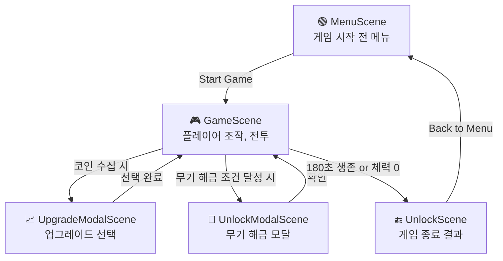

# 🍄 Mushroom Survivor

**MapleStory 스타일 생존형 2D 슈팅 게임**  
Phaser + JavaScript 기반으로 구현된 탑다운 슈터이며, 무기 해금, 업그레이드, 몬스터 처치 등의 핵심 기능을 갖춘 싱글플레이어 게임입니다.

## 🎮 데모

👉 [게임 플레이하기](https://mushroom-land.vercel.app)  
📝 [기획 문서 (Notion)](https://rainbow-appeal-099.notion.site/MushRoomLand-1d228f551d978053ace3c011d3d24200?pvs=4)

## 🗓 작업 기간

2025.04.16 ~ 2025.04.22 (1주일간 개발)

## 📦 기술 스택

- Vite
- TypeScript
- React
- shadcn-ui
- Tailwind CSS

- **게임 엔진**: Phaser 3
- **언어**: JavaScript
- **스타일링**: CSS
- **게임 구조**:
  - Scene 기반 구조 (`MenuScene`, `GameScene`, `UnlockScene`, 등)
  - UI: Phaser 텍스트 + 인터랙션
  - 무기 시스템, 스탯 업그레이드 시스템 포함

## 🏁 실행 방법

```bash
npm install
npm run dev
```

혹은 `index.html`을 브라우저에서 직접 열어 실행할 수 있습니다.

## 📁 디렉토리 구조

```
mushroom-survivor/
├── index.html
├── style.css
├── main.js
├── /components
│   ├── WeaponManager.js
│   ├── PlayerStats.js
│   └── SkillManager.js
├── /scenes
│   ├── GameScene.js
│   ├── MenuScene.js
│   ├── UnlockScene.js
│   ├── UnlockModalScene.js
│   └── UpgradeModalScene.js
└── README.md
```

## 🔥 핵심 기능


### 플로우 



### 🚀 플레이어 컨트롤
- `WASD`로 이동
- 마우스 방향 조준 및 자동 사격
- `SPACE`: 트리플샷 (쿨타임 5초)

### 💥 전투
- 다양한 무기 (기본 총알, 레이저, 미사일 등)
- 몬스터와의 충돌 시 체력 감소
- 일정 시간 생존 시 승리 (`180초` 기준)

### 🎯 무기 해금
- 처치 수가 10 이상일 경우 `missile` 해금
- 동적 무기 변경 및 저장 (`localStorage` 활용)

### ⚙️ 업그레이드 시스템
- 코인 수집마다 일정 확률로 업그레이드 창 등장
- 선택지 예시:
  - 공격력 증가
  - 이동 속도 증가
  - 체력 증가

### 📊 UI 구성
- EXP, Level, Coins, Health, Damage, Speed, 무기 이름 등 표시
- 반응형 레이아웃 (리사이즈 이벤트 대응)

### 🎨 메뉴
- 시작 버튼
- 현재 해금된 무기 목록 표시

## 📈 향후 계획

- 몬스터 다양화 및 보스 추가
- 아이템 드랍/합성 시스템
- 멀티플레이어 지원 (WebSocket 예정)
- TypeScript 기반 리팩토링


